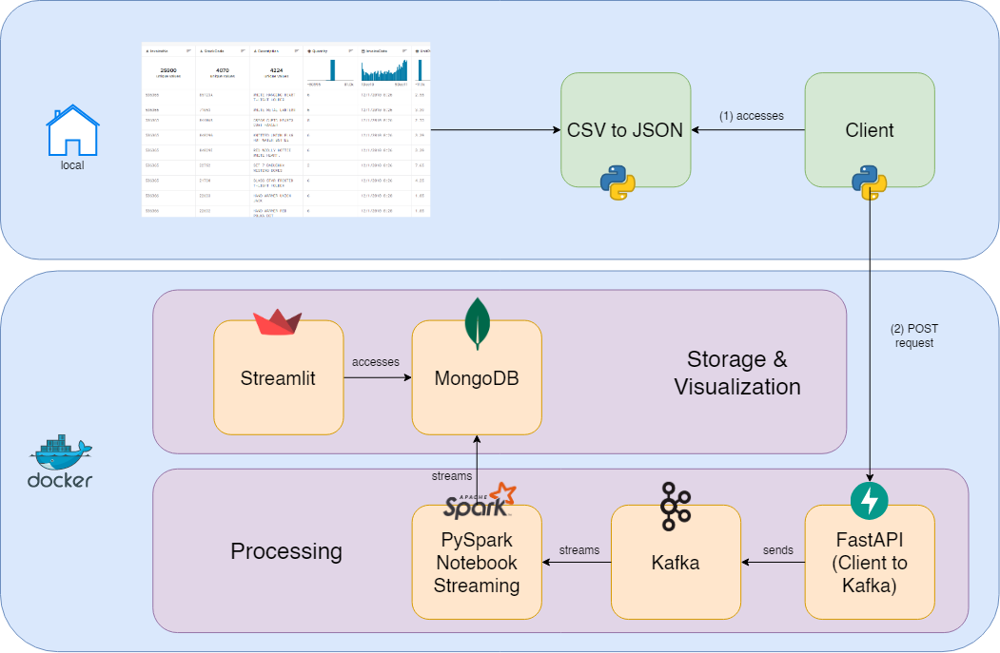
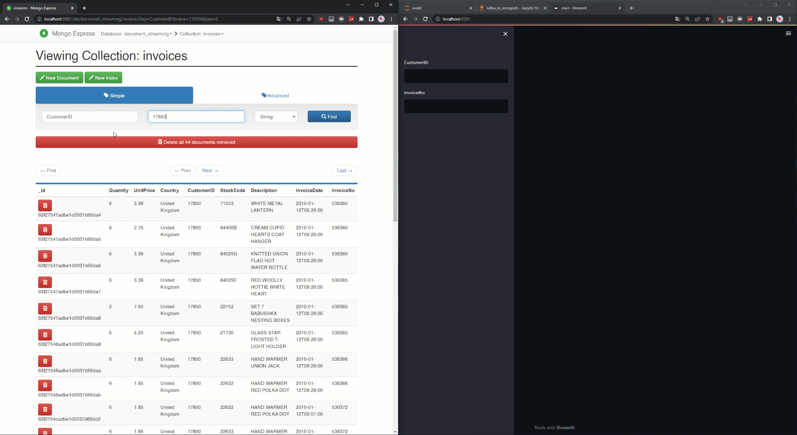

# Invoice Analytics Platform
This project aims to visualize invoices from customers of an e-commerce store.

# Introduction & Goals

The Invoice Analytics Platform is a project aimed at helping e-commerce stores gain insights into their customers' purchasing behavior. By processing a stream of e-commerce data using Kafka, Spark, and MongoDB, this platform provides a scalable and easy-to-use solution for analyzing large volumes of data.

Using the data set provided on Kaggle, this project generates JSON objects that contain information about customers, products, and invoices. The resulting data is then visualized in a dashboard using Streamlit, allowing e-commerce stores to quickly identify trends and patterns in their customers' purchasing behavior.

The goals of this project are to provide a platform that:

- Enables e-commerce stores to make data-driven decisions to improve customer satisfaction and increase sales
- Helps e-commerce stores gain valuable insights into their customers' behavior
- Provides a user-friendly and scalable solution for analyzing large volumes of data


# Contents
- [Demo](#demo)
- [The Data Set](#the-data-set)
- [Used Tools](#used-tools)
  - [Connect](#connect)
  - [Buffer](#buffer)
  - [Processing](#processing)
  - [Storage](#storage)
  - [Visualization](#visualization)
- [How to use](#how-to-use)

# Demo

<script>
  const gif = document.getElementById("my-gif");
  const observer = new IntersectionObserver(entries => {
    if (entries[0].isIntersecting) {
      gif.src = gif.src.replace(/\?.*/, "") + "?autoplay=1";
      observer.unobserve(gif);
    }
  }, { threshold: [1] });
  observer.observe(gif);
</script>



# The Data Set
Source: [Kaggle](https://www.kaggle.com/datasets/carrie1/ecommerce-data)

The project processes a stream of e-commerce data that is transformed into JSON objects. The data set is a CSV of e-commerce data that contains information about customers, products, and invoices. I chose this data set because it is publicly available on Kaggle and contains a wide range of data points that can be used to generate insights into customer behavior.

# Used Tools
I used the following tools in this project:

## Connect
Kafka - a robust and scalable data streaming platform. I chose Kafka because it allows for real-time data processing, ensuring that our platform is up-to-date with the latest information from our customers.

## Buffer
Spark - a powerful and versatile data processing engine. I chose Spark because it is highly efficient and can handle large datasets, making it ideal for analyzing the vast amount of invoice data we collect.

## Processing
FastAPI - a modern web framework for building APIs quickly and easily. I chose FastAPI because it allows me to quickly set up a scalable API to receive and process the incoming data.

## Storage
MongoDB - a NoSQL document-oriented database. I chose MongoDB because it allows for flexible and dynamic data storage, which is essential for our platform to accommodate the changing needs of our business.

## Visualization
Streamlit - an open-source app framework used for creating data dashboards and interactive applications. I chose Streamlit because it provides a straightforward way to visualize and interact with our invoice data in real-time.

I chose these tools because they are scalable, easy-to-use, and provide a high degree of flexibility in terms of processing and visualization.

# How to use
To use the platform, clone this repository, navigate to the directory, and install Docker on your machine if it is not already installed. Then, build the images and start the containers using the following commands:

```
docker build -t fastapi-ingest ./api/client-kafka
docker build -t streamlit-app ./streamlit
docker-compose up
```

Open up `localhost:8888` and take the token from your Spark docker log. Run all cells in the jupyter notebook

You can then use the `./client/api-client.py` script to send data to the platform. You can also use the sample data provided to quickly look up invoices for a specific customer. To check mongodb, open up `localhost:8081` in the document_streaming database.

Open up `localhost:8501` to use the streamlit application. You can use this sample data for a quick lookup:
```
CustomerID: 17850
InvoiceNo: 536365
```
